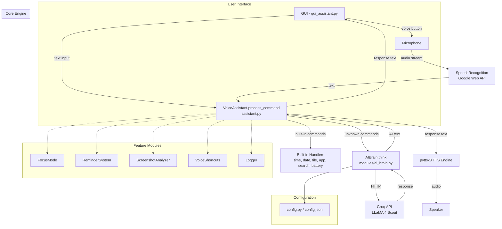
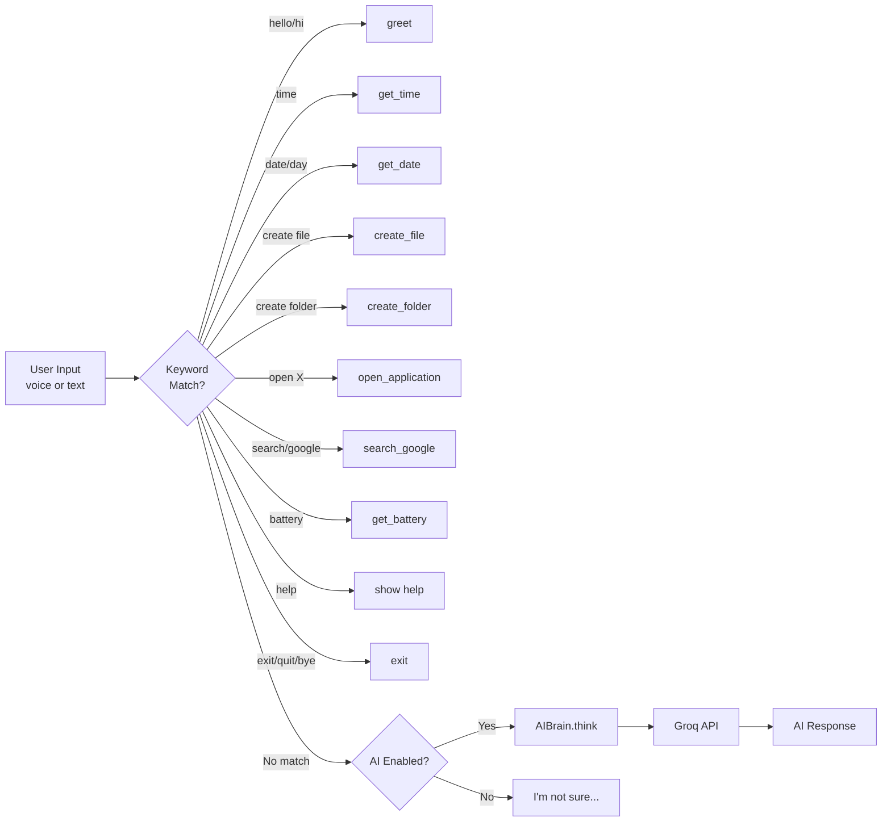

# 🤖 AI Desktop Assistant — Complete Project Documentation

> **Project Type:** Python Desktop Application (Voice-Controlled AI Assistant)
> **Language:** Python 3.11 · **GUI:** CustomTkinter · **AI:** Groq API (LLaMA 4 Scout)
> **License:** MIT · **Academic Year:** 2024–2025

---

## Table of Contents

1. [Project Overview](#1-project-overview)
2. [Architecture & Data Flow](#2-architecture--data-flow)
3. [Technology Stack](#3-technology-stack)
4. [Directory Structure](#4-directory-structure)
5. [Core Modules — Detailed Breakdown](#5-core-modules--detailed-breakdown)
6. [Feature Modules (plugins)](#6-feature-modules-plugins)
7. [Configuration System](#7-configuration-system)
8. [AI Integration (Groq / LLaMA)](#8-ai-integration-groq--llama)
9. [GUI Layer](#9-gui-layer)
10. [Command Processing Pipeline](#10-command-processing-pipeline)
11. [Testing](#11-testing)
12. [Build & Distribution](#12-build--distribution)
13. [Security Considerations](#13-security-considerations)
14. [Potential Improvements](#14-potential-improvements)

---

## 1. Project Overview

The **AI Desktop Assistant** (internally named **"Jarvis"**) is a voice-controlled desktop productivity tool built in Python. It allows users to:

- Issue **voice or text commands** to perform desktop tasks
- Have **AI-powered conversations** via the Groq cloud API (LLaMA model)
- Manage **files and folders**, launch **applications**, and perform **web searches**
- Use productivity tools: **Pomodoro focus timer**, **timed reminders**, and **voice shortcuts**
- Capture **screenshots** and extract text via **OCR** (Tesseract)
- Interact through a polished **dark-mode GUI** built with CustomTkinter

The project is structured as a **college EDI (Engineering Design & Innovation) final project**.

---

## 2. Architecture & Data Flow



### Data Flow Summary

| Step | Component | Action |
|------|-----------|--------|
| 1 | **GUI / CLI** | User speaks or types a command |
| 2 | **SpeechRecognition** | Converts audio → text via Google's Web Speech API |
| 3 | **VoiceAssistant.process_command()** | Routes the text to the correct handler using keyword matching |
| 4 | **Handler / AIBrain** | Executes the action or queries Groq API for an AI response |
| 5 | **pyttsx3** | Converts the response text to speech (SAPI5 on Windows) |
| 6 | **GUI chat display** | Shows the conversation in the CustomTkinter textbox |

---

## 3. Technology Stack

| Category | Library / Service | Purpose |
|----------|-------------------|---------|
| **Speech-to-Text** | `SpeechRecognition` 3.10 + `PyAudio` 0.2.14 | Captures microphone audio and uses Google Web Speech API for transcription |
| **Text-to-Speech** | `pyttsx3` 2.90 | Offline TTS via SAPI5 (Windows), NSSpeechSynthesizer (macOS), or espeak (Linux) |
| **AI / LLM** | `openai` SDK 1.3 → **Groq API** | OpenAI-compatible SDK pointed at `api.groq.com`; uses **LLaMA 4 Scout 17B** model |
| **GUI** | `customtkinter` 5.2 | Modern dark-themed Tkinter wrapper |
| **OCR** | `pytesseract` 0.3.10 + `Pillow` 10.0 | Screenshot capture (`ImageGrab`) + Tesseract OCR text extraction |
| **System Info** | `psutil` 5.9.5 | Battery status, system metrics |
| **Automation** | `pyautogui` 0.9.54 | GUI automation (available but not heavily used) |
| **Scheduling** | [schedule](file:///e:/COLLEGE/ASEP/EDI-1/EDI%20Final/modules/reminder_system.py#72-80) 1.2 | Task scheduling (imported as dependency) |
| **Config** | `python-dotenv` 1.0 | [.env](file:///e:/COLLEGE/ASEP/EDI-1/EDI%20Final/.env) file loading |
| **Build** | `PyInstaller` 6.2 | Packages the app into a standalone `.exe` |

---

## 4. Directory Structure

```
AI_Desktop_Assistant/
├── assistant.py                 # Core engine — VoiceAssistant class (CLI entrypoint)
├── gui_assistant.py             # GUI entrypoint — AssistantGUI class
├── config.py                    # Config class — JSON-based settings manager
├── config.json                  # Runtime configuration (name, voice, API key)
├── .env / .env.template         # Environment variables (API keys)
├── requirements.txt             # pip dependencies
├── build_script.py              # PyInstaller build automation
├── setup_api_key.py             # Interactive Groq API key setup wizard
├── test_ai.py                   # Standalone AI integration test
├── test_mic.py                  # Standalone microphone test
│
├── modules/                     # Feature modules (pluggable)
│   ├── __init__.py              # Package init (version 1.0.0)
│   ├── ai_brain.py              # AIBrain class — Groq LLM integration
│   ├── focus_mode.py            # FocusMode class — Pomodoro timer
│   ├── reminder_system.py       # ReminderSystem class — timed reminders
│   ├── screenshot_analyzer.py   # ScreenshotAnalyzer class — OCR
│   ├── voice_shortcuts.py       # VoiceShortcuts class — custom macros
│   └── logger.py                # Logger class — file + console logging
│
├── tests/                       # Unit tests
│   ├── __init__.py
│   └── test_assistant.py        # 7 test cases for VoiceAssistant
│
├── assets/sounds/               # Sound assets (placeholder, currently empty)
├── docs/                        # Documentation folder (currently empty)
├── logs/                        # Auto-generated runtime logs
│
├── README.md                    # Project README
├── USER_MANUAL.md, QUICK_START.md, SETUP_INSTRUCTIONS.md, etc.
├── LICENSE                      # MIT License
└── TREE.txt                     # Visual directory tree
```

---

## 5. Core Modules — Detailed Breakdown

### 5.1 [assistant.py](file:///e:/COLLEGE/ASEP/EDI-1/EDI%20Final/assistant.py) — The Core Engine

**File:** [assistant.py](file:///e:/COLLEGE/ASEP/EDI-1/EDI%20Final/assistant.py)
**Class:** [VoiceAssistant](file:///e:/COLLEGE/ASEP/EDI-1/EDI%20Final/assistant.py#23-282)

This is the **heart of the application**. It contains all business logic for command processing, speech I/O, and integrations.

#### Initialization ([__init__](file:///e:/COLLEGE/ASEP/EDI-1/EDI%20Final/modules/ai_brain.py#12-28))
- Initializes **pyttsx3** TTS engine with rate=180 wpm, volume=0.9
- Creates a **SpeechRecognition** recognizer instance
- Conditionally imports and initializes [AIBrain](file:///e:/COLLEGE/ASEP/EDI-1/EDI%20Final/modules/ai_brain.py#11-69) (graceful fallback if unavailable)
- Sets the assistant name to **"Jarvis"**

#### Key Methods

| Method | Description |
|--------|-------------|
| [speak(text)](file:///e:/COLLEGE/ASEP/EDI-1/EDI%20Final/assistant.py#53-58) | Prints text and plays it aloud via pyttsx3 |
| [listen()](file:///e:/COLLEGE/ASEP/EDI-1/EDI%20Final/assistant.py#59-80) | Opens microphone, adjusts for noise (0.5s), listens (5s timeout, 10s phrase limit), uses Google Web Speech API |
| [greet()](file:///e:/COLLEGE/ASEP/EDI-1/EDI%20Final/assistant.py#81-90) | Returns time-based greeting (morning/afternoon/evening) |
| [get_time()](file:///e:/COLLEGE/ASEP/EDI-1/EDI%20Final/assistant.py#91-96) / [get_date()](file:///e:/COLLEGE/ASEP/EDI-1/EDI%20Final/assistant.py#97-102) | Returns formatted current time/date |
| [create_file(filename)](file:///e:/COLLEGE/ASEP/EDI-1/EDI%20Final/assistant.py#103-118) | Creates [.txt](file:///e:/COLLEGE/ASEP/EDI-1/EDI%20Final/TREE.txt) file on the Desktop with timestamp header |
| [create_folder(foldername)](file:///e:/COLLEGE/ASEP/EDI-1/EDI%20Final/assistant.py#119-128) | Creates a folder on the Desktop |
| [open_application(app_name)](file:///e:/COLLEGE/ASEP/EDI-1/EDI%20Final/assistant.py#129-165) | Opens notepad, calculator, browser, or YouTube (cross-platform via `subprocess`) |
| [search_google(query)](file:///e:/COLLEGE/ASEP/EDI-1/EDI%20Final/assistant.py#166-171) | Opens Google search in default browser |
| [get_battery()](file:///e:/COLLEGE/ASEP/EDI-1/EDI%20Final/assistant.py#172-183) | Returns battery percentage and charging status via `psutil` |
| [process_command(command)](file:///e:/COLLEGE/ASEP/EDI-1/EDI%20Final/assistant.py#184-266) | **Main router** — matches keywords to handlers; falls back to AI for unrecognized commands |
| [run()](file:///e:/COLLEGE/ASEP/EDI-1/EDI%20Final/assistant.py#267-282) | CLI main loop — greet → listen → process → speak → repeat |

#### Command Routing Logic ([process_command](file:///e:/COLLEGE/ASEP/EDI-1/EDI%20Final/assistant.py#184-266))

```
"hello/hi/hey"        → greet()
"time"                → get_time()
"date/day"            → get_date()
"create file/make file" → create_file() (parses "named X" or "called X")
"create folder"       → create_folder()
"open X"              → open_application(X)
"search/google"       → search_google()
"battery"             → get_battery()
"your name/who are you" → identity response
"exit/quit/bye"       → exits the loop
"help"                → returns help text
(anything else)       → AIBrain.think() if AI is enabled
```

> [!IMPORTANT]
> The command matching is **keyword-based** (simple [in](file:///e:/COLLEGE/ASEP/EDI-1/EDI%20Final/modules/logger.py#30-33) checks), not NLP-based. Order of `elif` blocks matters — e.g., "open" must come after "create file" to avoid conflicts.

---

### 5.2 [gui_assistant.py](file:///e:/COLLEGE/ASEP/EDI-1/EDI%20Final/gui_assistant.py) — The GUI Layer

**File:** [gui_assistant.py](file:///e:/COLLEGE/ASEP/EDI-1/EDI%20Final/gui_assistant.py)
**Class:** [AssistantGUI](file:///e:/COLLEGE/ASEP/EDI-1/EDI%20Final/gui_assistant.py#11-245)

Wraps [VoiceAssistant](file:///e:/COLLEGE/ASEP/EDI-1/EDI%20Final/assistant.py#23-282) in a modern **CustomTkinter** dark-mode interface.

#### UI Layout (top to bottom)

| Section | Components |
|---------|------------|
| **Header** | Title label ("🤖 AI Desktop Assistant") + status indicator ("● Ready" / "● Listening...") |
| **API Key Bar** | Text entry field + "Save" button to configure Groq API key at runtime |
| **Chat Area** | Scrollable `CTkTextbox` showing timestamped conversation history |
| **Input Area** | Text entry field (supports Enter key) |
| **Button Bar** | 🎤 Listen · Send · Clear buttons |
| **Quick Actions** | ⏰ Time · 📅 Date · 🔋 Battery · ❓ Help quick-action buttons |

#### Key Behaviors

- **Voice Listening** runs on a **background daemon thread** to keep the GUI responsive
- **API Key Save** dynamically re-initializes [AIBrain](file:///e:/COLLEGE/ASEP/EDI-1/EDI%20Final/modules/ai_brain.py#11-69) with the new key and updates [config.json](file:///e:/COLLEGE/ASEP/EDI-1/EDI%20Final/config.json)
- All messages are timestamped in `HH:MM AM/PM` format
- Window size: **600×800** pixels

---

### 5.3 [config.py](file:///e:/COLLEGE/ASEP/EDI-1/EDI%20Final/config.py) — Configuration Manager

**File:** [config.py](file:///e:/COLLEGE/ASEP/EDI-1/EDI%20Final/config.py)
**Class:** [Config](file:///e:/COLLEGE/ASEP/EDI-1/EDI%20Final/config.py#9-48)

A simple JSON-backed key-value store for application settings.

#### Stored Settings (in [config.json](file:///e:/COLLEGE/ASEP/EDI-1/EDI%20Final/config.json))

| Key | Default | Description |
|-----|---------|-------------|
| `assistant_name` | `"Jarvis"` | Name of the assistant |
| `user_name` | `"User"` | Name of the user |
| `voice_rate` | `180` | TTS words per minute |
| `voice_volume` | `0.9` | TTS volume (0.0–1.0) |
| `ai_enabled` | `true` | Whether AI features are on |
| `wake_word` | `"hey jarvis"` | Wake word (not actively used in current code) |
| `theme` | `"dark"` | UI theme |
| `language` | `"en-US"` | Speech recognition language |
| [api_key](file:///e:/COLLEGE/ASEP/EDI-1/EDI%20Final/gui_assistant.py#222-240) | `""` | Groq API key |

---

## 6. Feature Modules (plugins)

All feature modules live in the `modules/` package. They are designed as **standalone classes** that can be instantiated independently.

### 6.1 [ai_brain.py](file:///e:/COLLEGE/ASEP/EDI-1/EDI%20Final/modules/ai_brain.py) — AI Brain

**File:** [ai_brain.py](file:///e:/COLLEGE/ASEP/EDI-1/EDI%20Final/modules/ai_brain.py)
**Class:** [AIBrain](file:///e:/COLLEGE/ASEP/EDI-1/EDI%20Final/modules/ai_brain.py#11-69)

| Aspect | Detail |
|--------|--------|
| **API Provider** | Groq (OpenAI-compatible endpoint at `api.groq.com/openai/v1`) |
| **Model** | `meta-llama/llama-4-scout-17b-16e-instruct` |
| **Max Tokens** | 100 per response |
| **Temperature** | 0.7 |
| **Conversation History** | Maintains last **10 messages** for context |
| **System Prompt** | _"You are a helpful desktop voice assistant named Jarvis. Provide concise, clear, and friendly responses. Keep answers under 50 words unless asked for details."_ |

The [think(user_input)](file:///e:/COLLEGE/ASEP/EDI-1/EDI%20Final/modules/ai_brain.py#29-65) method:
1. Appends user message to history
2. Trims history to 10 messages
3. Sends system prompt + history to Groq API
4. Returns the AI response text
5. Appends AI response to history

---

### 6.2 [focus_mode.py](file:///e:/COLLEGE/ASEP/EDI-1/EDI%20Final/modules/focus_mode.py) — Pomodoro Focus Timer

**File:** [focus_mode.py](file:///e:/COLLEGE/ASEP/EDI-1/EDI%20Final/modules/focus_mode.py)
**Class:** [FocusMode](file:///e:/COLLEGE/ASEP/EDI-1/EDI%20Final/modules/focus_mode.py#10-54)

| Method | Description |
|--------|-------------|
| [start(duration_minutes, task_name, callback)](file:///e:/COLLEGE/ASEP/EDI-1/EDI%20Final/modules/focus_mode.py#17-28) | Starts a focus session with a background countdown thread |
| [stop()](file:///e:/COLLEGE/ASEP/EDI-1/EDI%20Final/modules/focus_mode.py#44-47) | Stops the active session |
| [get_status()](file:///e:/COLLEGE/ASEP/EDI-1/EDI%20Final/modules/focus_mode.py#48-54) | Returns remaining time or "Not active" |

- Sends a **5-minute warning** via callback
- Tracks `sessions_completed` count
- Entirely **non-blocking** (uses daemon threads)

---

### 6.3 [reminder_system.py](file:///e:/COLLEGE/ASEP/EDI-1/EDI%20Final/modules/reminder_system.py) — Timed Reminders

**File:** [reminder_system.py](file:///e:/COLLEGE/ASEP/EDI-1/EDI%20Final/modules/reminder_system.py)
**Class:** [ReminderSystem](file:///e:/COLLEGE/ASEP/EDI-1/EDI%20Final/modules/reminder_system.py#12-80)

| Method | Description |
|--------|-------------|
| [add_reminder(message, minutes_from_now)](file:///e:/COLLEGE/ASEP/EDI-1/EDI%20Final/modules/reminder_system.py#35-50) | Creates a reminder and persists to `reminders.json` |
| [check_reminders()](file:///e:/COLLEGE/ASEP/EDI-1/EDI%20Final/modules/reminder_system.py#51-61) | Checks if any reminder's time matches current minute |
| [get_all_reminders()](file:///e:/COLLEGE/ASEP/EDI-1/EDI%20Final/modules/reminder_system.py#62-71) | Lists all pending (uncompleted) reminders |
| [start_scheduler()](file:///e:/COLLEGE/ASEP/EDI-1/EDI%20Final/modules/reminder_system.py#72-80) | Starts a background thread polling every **30 seconds** |

- Reminders are **persisted to disk** as JSON and survive restarts
- Uses minute-level granularity for matching (`%Y-%m-%d %H:%M`)

---

### 6.4 [screenshot_analyzer.py](file:///e:/COLLEGE/ASEP/EDI-1/EDI%20Final/modules/screenshot_analyzer.py) — Screenshot OCR

**File:** [screenshot_analyzer.py](file:///e:/COLLEGE/ASEP/EDI-1/EDI%20Final/modules/screenshot_analyzer.py)
**Class:** [ScreenshotAnalyzer](file:///e:/COLLEGE/ASEP/EDI-1/EDI%20Final/modules/screenshot_analyzer.py#15-63)

| Method | Description |
|--------|-------------|
| [capture_screen()](file:///e:/COLLEGE/ASEP/EDI-1/EDI%20Final/modules/screenshot_analyzer.py#19-27) | Takes a full-screen screenshot via `PIL.ImageGrab` |
| [extract_text(image)](file:///e:/COLLEGE/ASEP/EDI-1/EDI%20Final/modules/screenshot_analyzer.py#28-40) | Runs Tesseract OCR on the screenshot |
| [read_screen()](file:///e:/COLLEGE/ASEP/EDI-1/EDI%20Final/modules/screenshot_analyzer.py#41-49) | Captures + extracts text (truncated to 500 chars) |
| [save_screenshot(filename)](file:///e:/COLLEGE/ASEP/EDI-1/EDI%20Final/modules/screenshot_analyzer.py#50-63) | Saves screenshot to Desktop |

> [!NOTE]
> Requires **Tesseract OCR** to be installed at `C:\Program Files\Tesseract-OCR\tesseract.exe` on Windows.

---

### 6.5 [voice_shortcuts.py](file:///e:/COLLEGE/ASEP/EDI-1/EDI%20Final/modules/voice_shortcuts.py) — Custom Command Macros

**File:** [voice_shortcuts.py](file:///e:/COLLEGE/ASEP/EDI-1/EDI%20Final/modules/voice_shortcuts.py)
**Class:** [VoiceShortcuts](file:///e:/COLLEGE/ASEP/EDI-1/EDI%20Final/modules/voice_shortcuts.py#9-61)

| Method | Description |
|--------|-------------|
| [add_shortcut(name, commands)](file:///e:/COLLEGE/ASEP/EDI-1/EDI%20Final/modules/voice_shortcuts.py#43-48) | Registers a named shortcut mapping to a list of commands |
| [get_shortcut(name)](file:///e:/COLLEGE/ASEP/EDI-1/EDI%20Final/modules/voice_shortcuts.py#49-52) | Returns the command list for a shortcut |
| [list_shortcuts()](file:///e:/COLLEGE/ASEP/EDI-1/EDI%20Final/modules/voice_shortcuts.py#53-61) | Lists all available shortcut names |

**Default shortcuts:**
- `"study mode"` → opens notepad, opens YouTube, starts 25-min focus
- `"work mode"` → opens browser, opens calculator

Shortcuts are persisted to `shortcuts.json`.

---

### 6.6 [logger.py](file:///e:/COLLEGE/ASEP/EDI-1/EDI%20Final/modules/logger.py) — Application Logger

**File:** [logger.py](file:///e:/COLLEGE/ASEP/EDI-1/EDI%20Final/modules/logger.py)
**Class:** [Logger](file:///e:/COLLEGE/ASEP/EDI-1/EDI%20Final/modules/logger.py#10-45)

- Creates daily log files in `logs/assistant_YYYYMMDD.log`
- Dual handler: writes to **file** and **console**
- Standard levels: [info()](file:///e:/COLLEGE/ASEP/EDI-1/EDI%20Final/modules/logger.py#30-33), [error()](file:///e:/COLLEGE/ASEP/EDI-1/EDI%20Final/modules/logger.py#34-37), [warning()](file:///e:/COLLEGE/ASEP/EDI-1/EDI%20Final/modules/logger.py#38-41), [debug()](file:///e:/COLLEGE/ASEP/EDI-1/EDI%20Final/modules/logger.py#42-45)

---

## 7. Configuration System

The project uses a **dual configuration** approach:

| Source | File | Used For |
|--------|------|----------|
| **JSON Config** | [config.json](file:///e:/COLLEGE/ASEP/EDI-1/EDI%20Final/config.json) | App settings (name, voice, theme, API key) — managed by [Config](file:///e:/COLLEGE/ASEP/EDI-1/EDI%20Final/config.py#9-48) class |
| **Environment Variables** | [.env](file:///e:/COLLEGE/ASEP/EDI-1/EDI%20Final/.env) | API keys (OpenAI/Groq, Weather, News, Spotify) — loaded by `python-dotenv` |

> [!WARNING]
> The current codebase reads the Groq API key from [config.json](file:///e:/COLLEGE/ASEP/EDI-1/EDI%20Final/config.json) via the [Config](file:///e:/COLLEGE/ASEP/EDI-1/EDI%20Final/config.py#9-48) class, **not** from [.env](file:///e:/COLLEGE/ASEP/EDI-1/EDI%20Final/.env). The [.env](file:///e:/COLLEGE/ASEP/EDI-1/EDI%20Final/.env) file is present but the [AIBrain](file:///e:/COLLEGE/ASEP/EDI-1/EDI%20Final/modules/ai_brain.py#11-69) class does not call `load_dotenv()` or use `os.getenv()` — it exclusively reads from [config.json](file:///e:/COLLEGE/ASEP/EDI-1/EDI%20Final/config.json).

---

## 8. AI Integration (Groq / LLaMA)

### How It Works

1. The **OpenAI Python SDK** is used with a custom `base_url` pointing to Groq's API
2. The API key is stored in [config.json](file:///e:/COLLEGE/ASEP/EDI-1/EDI%20Final/config.json) and read by `AIBrain.__init__()`
3. The model used is **`meta-llama/llama-4-scout-17b-16e-instruct`** (a Meta LLaMA 4 model hosted on Groq)
4. Responses are capped at **100 tokens** to keep voice responses concise
5. A **rolling conversation history** (max 10 messages) provides context for multi-turn conversations

### Fallback Behavior

```python
# In assistant.py
try:
    from modules.ai_brain import AIBrain
    AI_AVAILABLE = True
except:
    AI_AVAILABLE = False
```

If [AIBrain](file:///e:/COLLEGE/ASEP/EDI-1/EDI%20Final/modules/ai_brain.py#11-69) cannot be imported or initialized (missing key, import error), the assistant **gracefully falls back** to responding with _"I'm not sure how to help with that."_ for unrecognized commands.

---

## 9. GUI Layer

### Framework: CustomTkinter

CustomTkinter is a modern wrapper around Python's built-in Tkinter that adds:
- Dark/light mode theming
- Rounded widgets (buttons, entries, frames)
- Modern aesthetic without web technologies

### Window Configuration
- **Size:** 600×800 pixels
- **Theme:** Dark mode (`ctk.set_appearance_mode("dark")`)
- **Color Theme:** Blue (`ctk.set_default_color_theme("blue")`)

### Threading Model

Voice listening runs on a **daemon thread** to prevent the GUI from freezing:

```python
threading.Thread(target=self.listen_and_respond, daemon=True).start()
```

> [!NOTE]
> The current implementation does **not** use `root.after()` for thread-safe GUI updates from the listening thread. This could occasionally cause Tkinter thread-safety issues.

---

## 10. Command Processing Pipeline



### Command Parsing

Commands use **simple string matching**:
- `any(word in command for word in [...])` for multi-keyword checks
- `'keyword' in command` for single-keyword checks
- File/folder names are extracted by finding `"named"` or `"called"` keyword and joining the remaining words with underscores

---

## 11. Testing

### Test Files

| File | Type | Description |
|------|------|-------------|
| [test_assistant.py](file:///e:/COLLEGE/ASEP/EDI-1/EDI%20Final/tests/test_assistant.py) | `unittest` | 7 unit tests for `VoiceAssistant.process_command()` |
| [test_ai.py](file:///e:/COLLEGE/ASEP/EDI-1/EDI%20Final/test_ai.py) | Standalone script | Tests AI import → API key → AIBrain init → response chain |
| [test_mic.py](file:///e:/COLLEGE/ASEP/EDI-1/EDI%20Final/test_mic.py) | Standalone script | Tests microphone detection, noise adjustment, and speech recognition |

### Unit Test Cases ([tests/test_assistant.py](file:///e:/COLLEGE/ASEP/EDI-1/EDI%20Final/tests/test_assistant.py))

| Test | What It Verifies |
|------|-----------------|
| [test_time_command](file:///e:/COLLEGE/ASEP/EDI-1/EDI%20Final/tests/test_assistant.py#20-24) | "what time is it" → response contains "time is" |
| [test_date_command](file:///e:/COLLEGE/ASEP/EDI-1/EDI%20Final/tests/test_assistant.py#25-29) | "what's the date" → response contains "today is" |
| [test_greet_command](file:///e:/COLLEGE/ASEP/EDI-1/EDI%20Final/tests/test_assistant.py#30-34) | "hello" → response contains "hello" |
| [test_response_time](file:///e:/COLLEGE/ASEP/EDI-1/EDI%20Final/tests/test_assistant.py#35-41) | Command processing completes in < 2 seconds |
| [test_unknown_command](file:///e:/COLLEGE/ASEP/EDI-1/EDI%20Final/tests/test_assistant.py#42-46) | Random input returns a non-None response |
| [test_exit_command](file:///e:/COLLEGE/ASEP/EDI-1/EDI%20Final/tests/test_assistant.py#47-51) | "exit" → returns exactly `"exit"` |
| [test_help_command](file:///e:/COLLEGE/ASEP/EDI-1/EDI%20Final/tests/test_assistant.py#52-56) | "help" → returns a non-None response |

**Run tests:**
```bash
python -m unittest tests.test_assistant
```

---

## 12. Build & Distribution

### Build Script

**File:** [build_script.py](file:///e:/COLLEGE/ASEP/EDI-1/EDI%20Final/build_script.py)

Uses **PyInstaller** to create a standalone Windows executable:

```bash
python build_script.py
```

#### PyInstaller Configuration

| Option | Value | Purpose |
|--------|-------|---------|
| `--onefile` | — | Single `.exe` output |
| `--windowed` | — | No console window (GUI app) |
| `--add-data` | `modules;modules` | Bundles the modules package |
| `--hidden-import` | `pyttsx3.drivers`, `pyttsx3.drivers.sapi5` | Ensures TTS drivers are included |
| `--collect-all` | `customtkinter` | Includes all CustomTkinter assets |
| `--icon` | `assets/icon.ico` (if exists) | Application icon |

**Output:** `dist/AI_Desktop_Assistant.exe`

---

## 13. Security Considerations

> [!CAUTION]
> The following security issues were identified in the codebase:

| Issue | Location | Risk |
|-------|----------|------|
| **API key in [config.json](file:///e:/COLLEGE/ASEP/EDI-1/EDI%20Final/config.json)** | [config.json](file:///e:/COLLEGE/ASEP/EDI-1/EDI%20Final/config.json) line 10 | A Groq API key is hardcoded in the tracked config file. This key should be stored only in [.env](file:///e:/COLLEGE/ASEP/EDI-1/EDI%20Final/.env) (which is gitignored) |
| **API key in [.env.template](file:///e:/COLLEGE/ASEP/EDI-1/EDI%20Final/.env.template)** | [.env.template](file:///e:/COLLEGE/ASEP/EDI-1/EDI%20Final/.env.template) line 2 | The template file contains what appears to be a real OpenAI API key instead of a placeholder |
| **Bare `except:` clauses** | Multiple files | Silently swallows all exceptions, making debugging very difficult |
| **No input sanitization** | [assistant.py](file:///e:/COLLEGE/ASEP/EDI-1/EDI%20Final/assistant.py) lines 200–231 | File/folder names from voice input are not sanitized for path traversal or special characters |

---

## 14. Potential Improvements

| Area | Suggestion |
|------|------------|
| **Security** | Move API key exclusively to [.env](file:///e:/COLLEGE/ASEP/EDI-1/EDI%20Final/.env) and remove from [config.json](file:///e:/COLLEGE/ASEP/EDI-1/EDI%20Final/config.json); replace [.env.template](file:///e:/COLLEGE/ASEP/EDI-1/EDI%20Final/.env.template) placeholder keys with dummy values |
| **Command Parsing** | Replace simple keyword matching with regex or an NLP intent-classification approach for more robust command recognition |
| **Error Handling** | Replace bare `except:` with specific exception types and add logging |
| **Thread Safety** | Use `root.after()` for GUI updates from the listening thread to prevent potential Tkinter crashes |
| **Feature Modules** | The [FocusMode](file:///e:/COLLEGE/ASEP/EDI-1/EDI%20Final/modules/focus_mode.py#10-54), [ReminderSystem](file:///e:/COLLEGE/ASEP/EDI-1/EDI%20Final/modules/reminder_system.py#12-80), [ScreenshotAnalyzer](file:///e:/COLLEGE/ASEP/EDI-1/EDI%20Final/modules/screenshot_analyzer.py#15-63), and [VoiceShortcuts](file:///e:/COLLEGE/ASEP/EDI-1/EDI%20Final/modules/voice_shortcuts.py#9-61) modules are defined but **not wired into** [process_command()](file:///e:/COLLEGE/ASEP/EDI-1/EDI%20Final/assistant.py#184-266) in [assistant.py](file:///e:/COLLEGE/ASEP/EDI-1/EDI%20Final/assistant.py) — they need to be integrated |
| **Wake Word** | The `wake_word` config option exists but is not implemented in the listening pipeline |
| **Sound Assets** | The `assets/sounds/` directory is empty — could add notification sounds for reminders and focus mode |
| **Tesseract Path** | The Tesseract path is hardcoded; should be configurable or auto-detected |
| **Voice Selection** | Allow users to pick different TTS voices in the GUI |
| **Offline Mode** | Add graceful handling when internet is unavailable (affects both speech recognition and AI) |

---

> **Summary:** This is a well-structured college project demonstrating a Python desktop assistant with voice control, AI conversations (Groq/LLaMA), file management, app launching, web search, and a modern dark-mode GUI. The modular architecture in `modules/` is clean, though several feature modules (focus, reminders, screenshots, shortcuts) are implemented but not yet connected to the main command processor.
